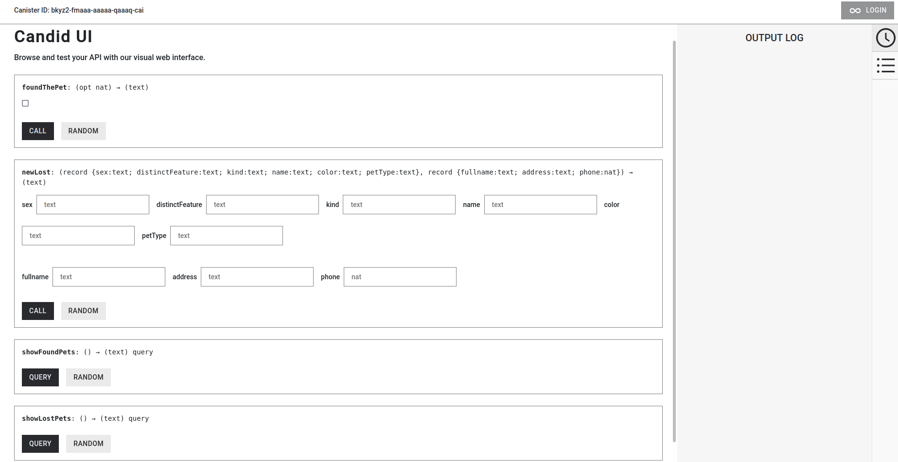
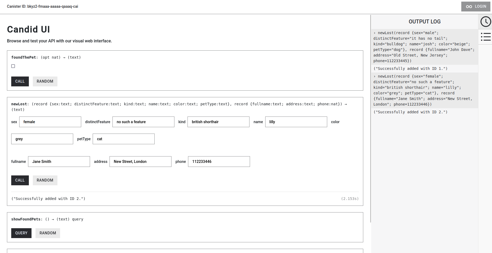
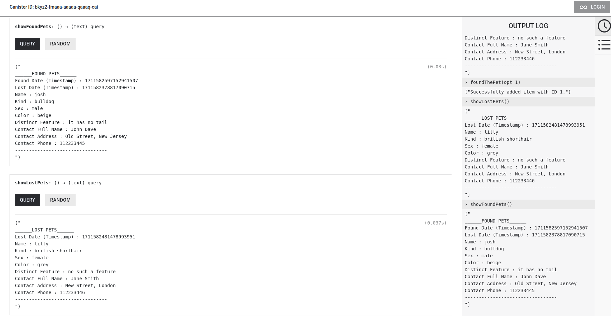

# Petify: Find Lost Pets on the Internet Computer Blockchain - Bootcamp Final Project

This is an 'Announcement' *dApp* (Decentralized Application) with *Motoko* backend built on the *Internet Computer* blockchain, allowing users to create an announcement of their lost pet and see the current list of lost and found pets.

## Purpose of the Project
Creating an announcement of the lost pet through the decentralized platform *ICP*, which creates an immutable, confidental, and secure record of the pet owner. On the other hand, the other type of users can access the list of lost pets and might help find them by contacting the pet owners with the contact information mentioned in the announcement.

## Data Types
The *dApp* uses several programmer-designed data types:
- `Contact`: Represents the contact information of the announcement creator i.e. the lost pet owner. Consists of a full name, address, and phone number.
- `Pet`: Represents the lost pet. Consists of pet type which describes what type of animal the pet is, kind of the specified pet, sex, color, pet's personal name, and distinct features if it has any.
- `Time`: Represents the date and time as nanoseconds since 01-01-1970. (Basically, the timestamp in nanoseconds.)
- `Announcement`: Represents the created announcement of the lost pet. Consists of pet and contact information, lost and found date (as timestamp).

## Functions
The following functions are provided to the users by the *dApp*:
- `newLost`: It creates a new announcement object and adds to the lost pets list. It is a *update* function.
- `foundThePet`: It adds the announcement object of the found pet to the found pets list. Afterwards, deletes from the lost pets list. It is a *update* function.
- `showLostPets`: Displays all the announcements inside the lost pets list. It is a *query* function.
- `showFoundPets`: Displays all the announcements inside the found pets list. It is a *query* function.

And, these are the private functions used within the *canister* (smart contract):
- `natHash`: It generates a hash value from a *Nat* (Natural number) value. It's used to create unique and secure identifiers (IDs).
- `getLostPets`: It returns the iteration result of the list of stored lost pets.
- `getFoundPets`: It returns the iteration result of the list of stored found pets.

## Run the Project locally
To test the project locally, just follow the steps below.
>***CAUTION:*** *The following steps are indicated assuming that the necessary setups to run an ICP project have already been done!*

First, be sure that your terminal directory is same as where the *dfx.json* file is located. This is the project directory.
Now, split the terminal (two terminal windows with the mentioned directory).
Run the following command on the first terminal to start the replica:
```bash
dfx start --clean
```
Once the replica is initialized and the dashboard is created (will be specified in the terminal), run the following command on the second terminal to deploy the *canister* to the replica and generate the *CandidUI* (Web Interface):
```bash
dfx deploy
```
Once the process completes, there will be a link provided which directs to the *CandidUI*.
The *dApp* is ready to be tested!

## Visual Examples - CandidUI
### First Glance

### Create New Announcement

### Show The Lists
